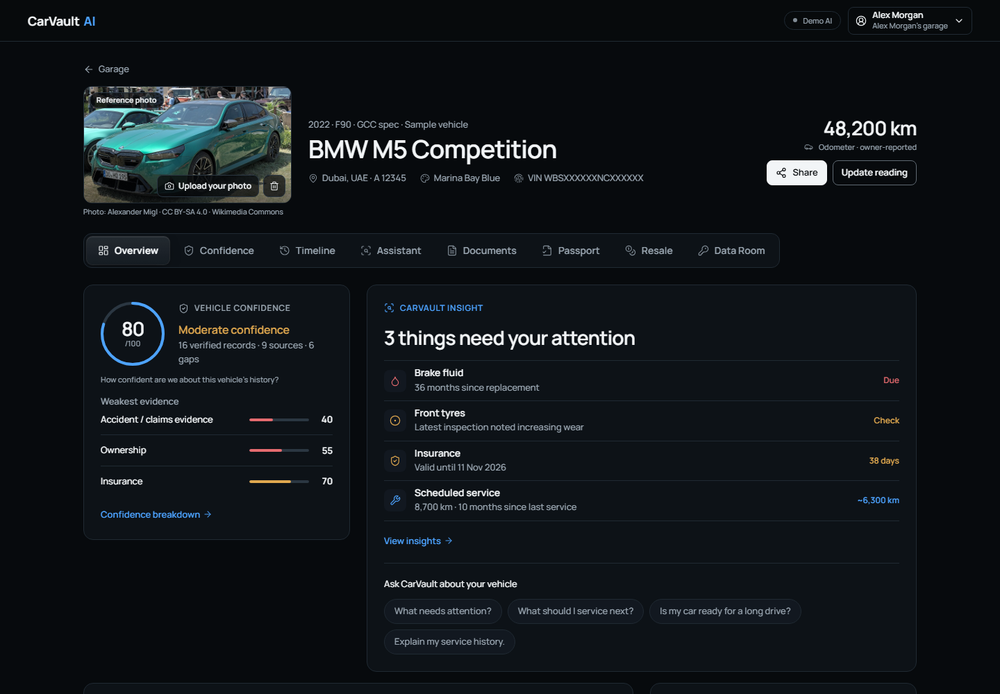
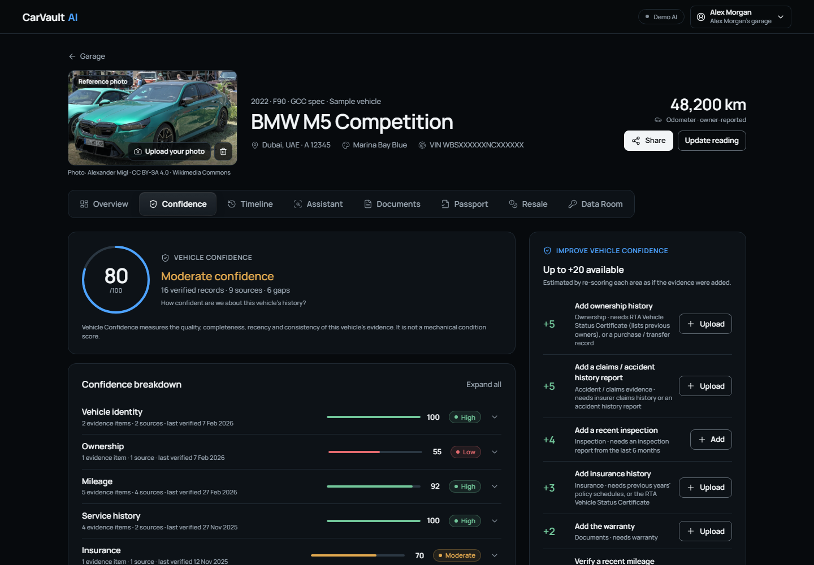
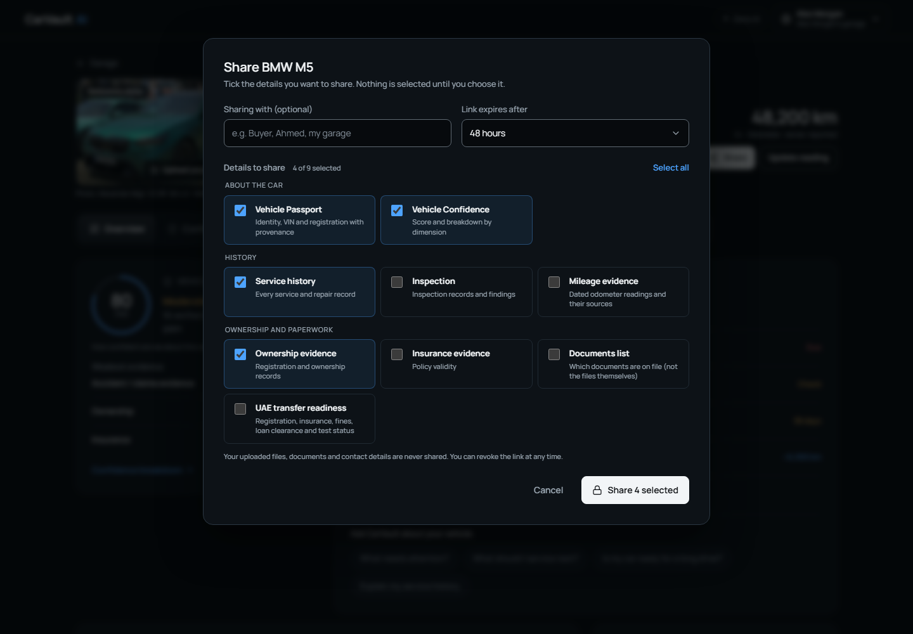
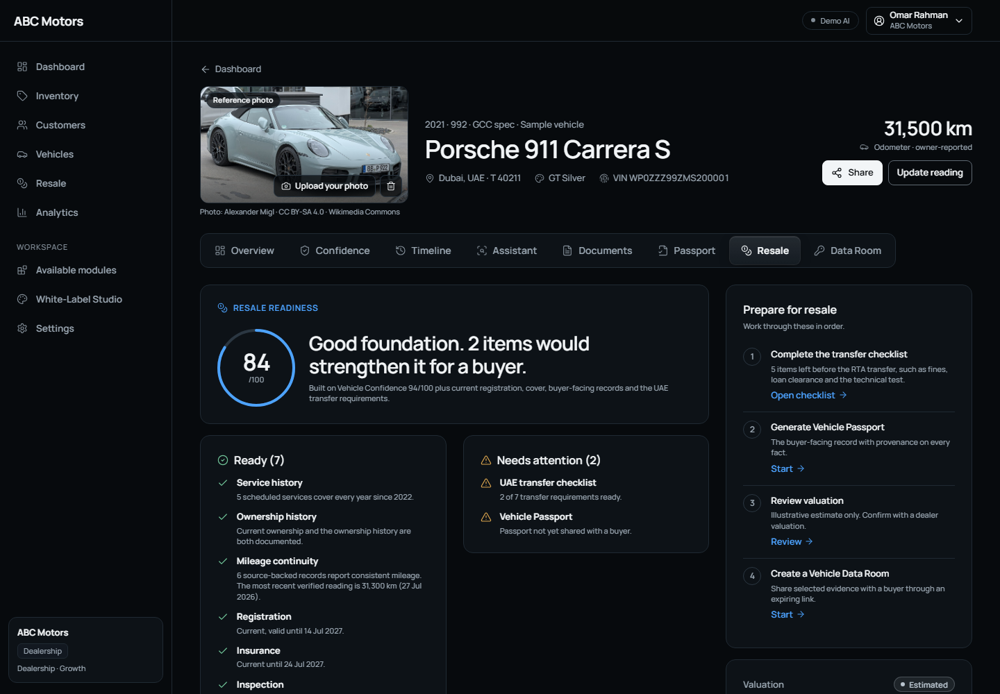
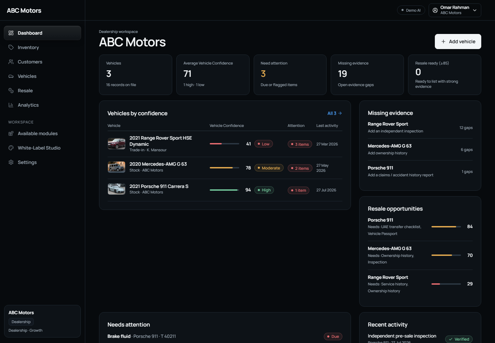
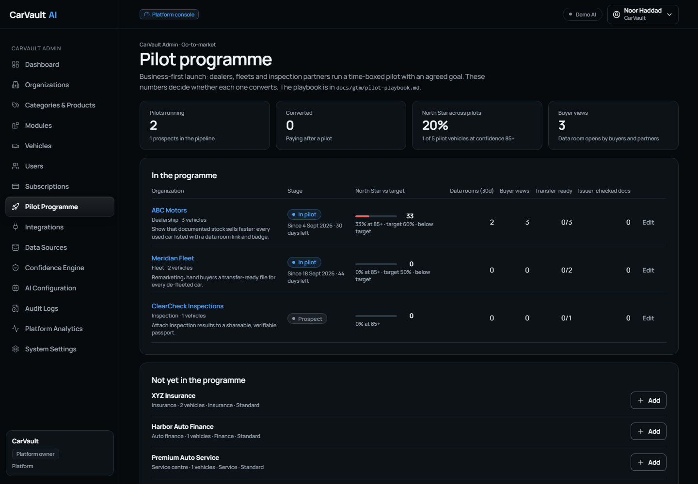
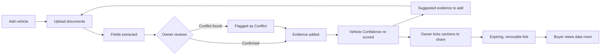
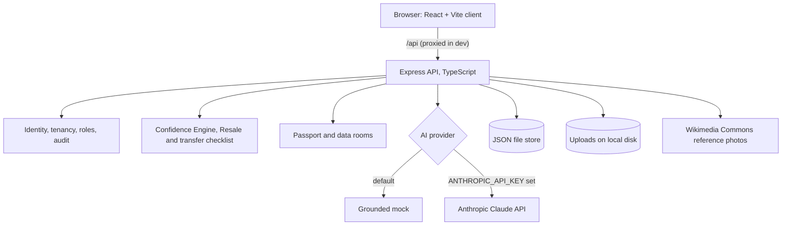

<h1 align="center">CarVault AI</h1>

<p align="center"><b>A trusted, evidence-backed record of a car's whole life, built for the UAE.</b></p>

<p align="center">
  
  
  
  
  
</p>

<p align="center">
  
  <br><sub>An owner's vehicle page: identity first, then Vehicle Confidence, then what needs attention.</sub>
</p>

> **Product Management capstone project.** CarVault is a working prototype with fictional sample data. Its AI runs in demo mode until an API key is added.

**Quick links:** [Product Walkthrough](#-product-walkthrough) · [Product Thinking](#-product-thinking) · [Getting Started](#-getting-started) · [Partner integration guide](docs/partners/partner-integration.md) · [Pilot playbook](docs/gtm/pilot-playbook.md)
<!-- TODO: add Live Demo, Capstone Report, Figma and Demo Video links when they exist -->

## Contents

- [Product Walkthrough](#-product-walkthrough)
- [The Problem](#-the-problem)
- [The Solution](#-the-solution)
- [Key Features](#-key-features)
- [Who It's For](#-who-its-for)
- [Product Thinking](#-product-thinking)
- [How It Works](#-how-it-works)
- [Tech Stack](#-tech-stack)
- [Getting Started](#-getting-started)
- [Project Structure](#-project-structure)
- [Security & Privacy](#-security--privacy)
- [Roadmap](#-roadmap)
- [Known Limitations](#known-limitations)
- [Documentation](#documentation)
- [Team & Acknowledgements](#team--acknowledgements)
- [License](#license)

## 📸 Product Walkthrough

<table>
  <tr>
    <td width="50%"><br><sub><b>Vehicle Confidence.</b> Eight evidence areas, each explained, with the points each missing document would add.</sub></td>
    <td width="50%"><br><sub><b>Owner sharing.</b> Every section starts unticked; the owner chooses what a buyer, garage or insurer sees.</sub></td>
  </tr>
  <tr>
    <td width="50%"><br><sub><b>Resale Readiness.</b> What's ready for a buyer, what isn't, and the steps to fix it, including the UAE transfer checklist.</sub></td>
    <td width="50%"><br><sub><b>Dealer workspace.</b> Stock ranked by confidence, with missing evidence and resale opportunities per car.</sub></td>
  </tr>
</table>

## 🚩 The Problem

The UAE had **4.56 million active registered vehicles in June 2025, up 9.35% in a year** (Salik / RTA data via Khaleej Times; see the capstone PRD's sources). A car's history is scattered across dealer invoices, workshops, insurer PDFs, registration cards and WhatsApp threads. Buyers fall back on seller claims or a one-off VIN history report costing about AED 99–120. Owners can't prove the care they've put in, and dealers, insurers and lenders re-check the same facts on every car.

## 💡 The Solution

CarVault makes the **vehicle**, not the person or the workshop, the unit of truth. It collects a car's documents into one record where every fact shows its source. It scores how well that history is evidenced (**Vehicle Confidence**, 0–100), shows what would raise the score, and lets the owner share selected sections through an expiring, revocable link. The same platform is licensed, under the client's own brand, to dealerships, insurers, lenders, service centres, inspection companies and fleets.

## ✨ Key Features

All features below exist in the code. The screenshots are in the walkthrough above.

| Feature | What it does | User benefit |
|---|---|---|
| **Vehicle Confidence** | Scores 8 evidence areas (identity, ownership, mileage, service, insurance, inspection, accident/claims, documents) and lists the gain from each missing item | Owners know exactly what to add; buyers see how solid the history is |
| **Document upload & review** | Extracts fields from invoices, policies, registration cards and inspection reports; nothing is saved until a person confirms it | A complete record without manual data entry |
| **Conflict detection** | Flags mileage that goes backwards, future dates, duplicates and VIN mismatches | Odometer and paperwork problems surface instead of hiding |
| **CarVault Insight & Assistant** | Maintenance and expiry insights, and answers from the car's own records, each labelled verified, inferred, estimated or unknown | Clear next steps with no guesswork presented as fact |
| **Owner sharing (Data Room)** | The owner ticks sections to share; the link expires (24 h–7 days), can be revoked, and comes with a QR code | Control over what each recipient sees; uploaded files are never shared |
| **Vehicle Passport** | A printable, shareable record where every fact carries a trust label and source | A history a buyer can believe |
| **Resale Readiness + UAE transfer checklist** | Readiness score plus the RTA transfer requirements: Mulkiya, insurance, fines, loan clearance, technical test, Emirates ID, buyer insurance | Fewer surprises at the transfer appointment |
| **Official evidence** | Imports the RTA Vehicle Status Certificate (owners, insurance history, odometer at each test); it becomes Verified only after a person checks it with the issuer | Strong evidence without a registry integration |
| **Multi-tenant, white-label platform** | 7 industry categories plus a full-platform bundle, 28 licensable modules, a White-Label Studio and server-side tenant isolation | One product sold to many kinds of automotive business |
| **CarVault Admin** | Licensing, branding, Confidence Engine weights, audit log, data sources and pilot programme tracking | Central governance of the trust model |
| **Light & dark themes, mobile, RTL-ready** | Per-person theme setting, a phone layout with bottom navigation, logical CSS for right-to-left text | Accessible on any device; prepared for Arabic |

## 👥 Who It's For

**Primary persona: Alex, premium car owner.** An expat professional in Dubai with 1–3 cars. *"Know what my car needs and prove its history when I sell."*

**Secondary users:**

| Persona | Job to be done |
|---|---|
| Omar · Dealership used-car head | Prove provenance fast so premium stock sells at full price |
| Daniel · Insurance underwriter | Price risk on evidence, not declarations |
| Priya · Finance collateral manager | Confirm identity, ownership and value before lending |
| Lena · Fleet manager | Keep vehicles earning and costs predictable |
| Noor · CarVault platform admin | License, brand and govern every tenant safely |

These are proto-personas from desk research. Interview-backed personas are still to come.
<!-- TODO: replace with research-backed personas after customer interviews -->

## 🧠 Product Thinking

| Area | Summary |
|---|---|
| **Value proposition** | For UAE owners and automotive businesses who need to trust a vehicle's history: a living, verified, explainable and shareable record, not a one-off report. |
| **Market size (owners, B2C)** | **TAM** AED 123M–319M/yr · **SAM** AED 51M–134M/yr · **SOM (Year 3)** AED 1.0M–5.4M. Only the 4.56M-vehicle base is sourced; the premium share, reach, penetration and price are assumptions. B2B Year 3 ARR is a hypothesis of AED 1.8M–12M. |
| **Market context** | UAE used-car market estimates for 2025 range from USD 20.6B to 23.5B across three research firms. |
| **Competitors & differentiator** | CARFAX Middle East, Autodata ME, dubizzle, CarSwitch, Cars24 UAE and OEM apps. None reviewed combines a living multi-source record, an explainable evidence score, and B2B licensing with white-labelling. |
| **Key research insights** | Desk research only so far: existing tools answer one-off questions (a VIN report, a listing, an inspection) but don't maintain a record across owners. Buyers pay about AED 99–120 per VIN report. <!-- TODO: add interview / survey findings --> |
| **MVP scope** | **In:** Vehicle Confidence, document review with conflict checks, insights and assistant, Passport, owner sharing, Resale Readiness with the UAE checklist, multi-tenant licensing, white-label, admin console. **Out:** real sign-in (SSO / UAE PASS), Arabic text, live registry and insurer integrations, market valuation data, workshop booking. |
| **North Star metric** | **Trusted Active Vehicles (TAV):** vehicles with Vehicle Confidence ≥ 85 whose evidence was added or re-verified in the last 90 days. |
| **KPIs (targets are hypotheses)** | Pilot month 6: 60 TAV · activation ≥ 50% (3 confirmed documents in 7 days) · gap closure ≥ 25% · median confidence uplift +10 points in 60 days. Guardrails: extraction accuracy ≥ 95%, zero unsupported AI claims, zero cross-tenant incidents. |
| **Business model & pricing (hypotheses)** | Owner subscription AED 299–499 per vehicle per year · premium tier AED 1,500–3,000 per year · B2B AED 10–25 per vehicle per month · verification and data rooms AED 50–150 each · 5–10% commission on services. |
| **Go-to-market** | Business first: dealer, fleet and inspection pilots with an agreed North Star target ([pilot playbook](docs/gtm/pilot-playbook.md)). Marketplaces receive owner-approved links and a listing badge ([partner guide](docs/partners/partner-integration.md)). |

<p align="center">
  
  <br><sub>CarVault Admin tracks each design-partner pilot against its North Star target.</sub>
</p>

Full sources, assumptions and the metric tree are in the capstone PRD.
<!-- TODO: link the PRD / capstone report once it is published (it is currently excluded from the repo by .gitignore) -->

## ⚙️ How It Works

**Owner flow**



**Architecture**



## 🧰 Tech Stack

| Layer | Technology |
|---|---|
| Front end | React 18, TypeScript 5, Vite 5, React Router 6, lucide-react icons, qrcode |
| Back end | Node.js, Express 4, TypeScript (run with tsx), multer for uploads |
| Data | JSON file store and local file uploads (no database) |
| AI | Provider interface: grounded mock by default, Anthropic Claude when a key is set |
| Design | CSS design tokens, Manrope typeface, light and dark themes, logical properties for RTL |

## 🚀 Getting Started

**Prerequisites:** Node.js (developed with v24.20.0) and npm (v11.19.0). <!-- TODO: confirm the minimum supported Node version -->

```bash
git clone https://github.com/ubhavesh96/CarVault.git
cd CarVault
npm install
cp .env.example .env   # optional: only needed to change defaults
npm run dev            # API on http://localhost:4000, app on http://localhost:5173
```

Open **http://localhost:5173** and choose a sample persona. There are no passwords; the demo login lets you act as an owner, a dealer, an insurer, a fleet or CarVault Admin.

| Variable | Purpose | Default |
|---|---|---|
| `ANTHROPIC_API_KEY` | Turns on live document extraction and the assistant via Claude. Leave empty for the built-in mock. | empty |
| `AI_PROVIDER` | Force `mock` or `claude` | `claude` if a key is set, else `mock` |
| `CARVAULT_MODEL` | Claude model id | `claude-sonnet-5` |
| `PORT` | API port | `4000` |
| `REFERENCE_IMAGES` | Set to `off` to stop fetching reference photos from Wikimedia Commons (not in `.env.example`) | `on` |

| Command | What it does |
|---|---|
| `npm run dev` | Runs the API and web app together, with live reload |
| `npm run build` then `npm start` | Builds the client and serves everything from one server on port 4000 |
| `npm run typecheck` | Type-checks server and client |

There are no automated tests yet; `npm run typecheck` is the current check. Sample data is created on first run, and **Reset demo data** in the account menu restores it.
<!-- TODO: add a test suite and an `npm test` script -->

## 🗂 Project Structure

```text
CarVault/
├── client/            React web app
│   └── src/
│       ├── pages/       Screens: owner, tenant, admin, public share pages
│       ├── components/  Shared UI: passport, share dialog, theme toggle
│       └── *.css        Design tokens and platform styles
├── server/            Express API
│   ├── src/           Routes, auth, Confidence Engine, transfer checklist, AI providers
│   ├── assets/        Sample vehicle photo used by the demo data
│   └── data/          Local JSON store and uploads (created at runtime, git-ignored)
└── docs/
    ├── screenshots/   Images used in this README
    ├── gtm/           Pilot playbook
    └── partners/      Partner integration guide
```

## 🔒 Security & Privacy

What the code does today:

- **No real authentication.** A demo persona switcher sends the chosen user id in a header and a cookie. Every permission check runs on the server: tenant isolation (another tenant's vehicle returns 404), roles, module licensing, and an audit log of the last 500 actions.
- **Storage is not encrypted.** Data lives in `server/data/db.json`, and uploaded documents sit as plain files in `server/data/uploads/` on the server's disk. Both are excluded from Git.
- **Sharing:**
  - Data-room links use random 18-byte tokens. They expire after 24 hours to 7 days and can be revoked at any time. They show only the sections the owner selected, never the uploaded files.
  - Full-passport links use random 12-byte tokens and stay active until the owner turns them off.
- **Data minimisation:** the transfer checklist never stores Emirates ID numbers, and buyers don't see which staff member confirmed an item.
- **AI:** with `ANTHROPIC_API_KEY` set, uploaded documents are sent to Anthropic's API for extraction. Without it, everything stays on the local server.
- **Not yet in place:** CORS allows any origin, there's no rate limiting, and HTTPS is left to hosting.

<!-- TODO: encryption at rest, real sign-in (SSO / UAE PASS) with MFA, UAE PDPL compliance review, UAE data residency, consent and data-deletion flows -->

## 🗺 Roadmap

**Done**
- [x] Vehicle Confidence with evidence chains and improvement gains
- [x] Document review with conflict detection
- [x] Vehicle Passport and owner-controlled sharing (data rooms)
- [x] Resale Readiness with the UAE transfer checklist
- [x] RTA certificate import with issuer verification
- [x] Multi-tenant licensing, White-Label Studio and CarVault Admin
- [x] Light and dark themes checked against WCAG AA contrast

**In progress (partial)**
- [ ] Live document extraction with Claude (built, not yet tested on real documents)
- [ ] Arabic: right-to-left layout ready, text not yet translated

**Planned**
- [ ] Real sign-in: SSO for businesses, UAE PASS for owners, MFA for admins
- [ ] Dealer and insurer / lender pilots, plus discovery and pricing research
- [ ] Dealer management system and fleet imports; passport transfer on sale
- [ ] Registry (RTA / ITC) and insurer-claims integrations
- [ ] Market valuation data, and workshop booking with owner approval
- [ ] KSA expansion and an open partner API

## Known Limitations

- Sign-in is a demo persona switcher; there is no authentication yet.
- Document extraction is simulated until an API key is configured.
- "Imported" records for sample businesses are seeded data, not live integrations.
- Valuations use an illustrative age-and-mileage model, not UAE market data.
- Storage is JSON files on local disk, with no database and no encryption.
- All organizations, people, workshops and vehicles are fictional.

## Documentation

| Document | Link |
|---|---|
| Pilot playbook (go-to-market) | [docs/gtm/pilot-playbook.md](docs/gtm/pilot-playbook.md) |
| Partner integration guide | [docs/partners/partner-integration.md](docs/partners/partner-integration.md) |
| PRD / capstone report | <!-- TODO: link once published --> Not in the repository yet |
| Research & interviews | <!-- TODO --> Not yet available |
| Financial model | <!-- TODO --> Not yet available |

## Team & Acknowledgements

Product management and design by [@ubhavesh96](https://github.com/ubhavesh96).
<!-- TODO: add full name, team members, mentors and capstone programme -->

Reference vehicle photos come from Wikimedia Commons under their stated free licences, credited in the app. Icons are from Lucide, and the typeface is Manrope.

## License

<!-- TODO: choose a license and add a LICENSE file -->
No license has been chosen yet, so all rights are reserved by default.
